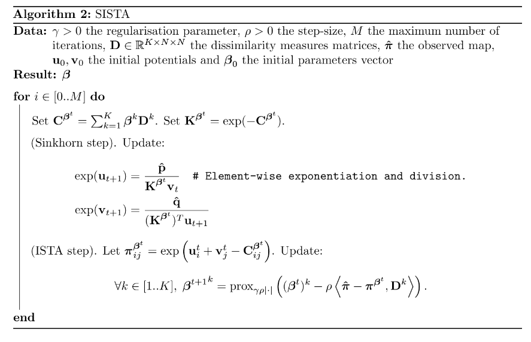

# mva-optimal-transport

This repository contains a project report for the course Optimal Transport of the master MVA which is based on the file `main_study_article.pdf`.
The report of this course project can be found in `project_report.pdf`.

What was expected:
- Present the problem studied in the main article (`main_study_article.pdf`).
- Explain the theoretical guarantees that were not explained in the original article.
- Search for eventual limits not given in the main article.
- New numerical experiments.
